# Design Process

## Ideas

After playing the videogame "Hollow knight: Silksong" I saw the <a href="https://youtu.be/HMSr3H0OE-k?si=2-vZHwZw0nw9UrAF"> following video </a> about the design of a metroidvania board game. This design requires a player and a game master, which I feel defeats the whole purpose because to hame a player mastering a game for another one you could be just playing the videogame (I want to clarify that I love roleplaying games, but I feel like that is more of a social experience than a well defined boardgame). So I decided to design a boardgame inspired on a metroidvania that could be played by 4 players.

## Concept

I had very clear some ideas about the game:

- I wanted there to be rooms you needed an object to traverse.
- I obviously wanted objects which played a huge importance in the game.
- I wanted the players to fight enemies and that to be the main way to win the game.
- I wanted the board to be adjustable, ideally it being procedurally generated using tilesets.

From here some very important questions remained 

- Did I want the game to be cooperative or competitive? 
- How did I want the game to end?
- How did I want combat to work?
- How was the game going to be procedurally generated?

## Making it a competitive game

I decided to make the game competitive as I wanted to distinguish it from a videogame. I decided then I wanted the game to balance itself by adding difficulty to the most advanced players.

### The pocket system

Because I wanted to make the objects the most important part of the game, how many objects a player had was a good unit to measure who was the more powerful player in the game. For this reason I decided to allow players to have 6 actions every turn measured in "free pockets", but when a player obtained an object they would have to store it in a pocket and lose that pocket as an action. This way the more powerful players would have less actions to do every turn.

I realized very early that this system was way too punishing to players making the objects meaningless. To solve this I decided that a player could use a pocket with an object only to activate that object's ability. this way I would reduce the number of actions but The objects would still become powerful.

### Victory condition

Fighting enemies was still going to be the main victory condition and the easiest way to count this was by using points. This would allow me to include alternative winning conditions to make the game more interesting. I was not yet sure how to end the game so while I thought of something in this first version the game would end when all enemies had entered the game.

### The traps

I wanted rooms which required an object to be traversed, but for that I would need to make a lot of copies of one object and it would make the board generation troublesome. For this reason I decided to make those rooms give a penalization instead of stopping players all together and players would only be able to avoid that penalization if they had the required object. I decided to call those rooms "traps" and the standard penalization would be losing a certain amount of "life points" which led me to the next decision in the game.

### Life points and dying

If losing life was going to be as easy as having to traverse a trap then the penalization for dying needed to be tame, else the players would not ever consider passing through traps and the game would feel very fragmented. I decided then that when a player died they would return to the point were the game started and the would lose a fixed amount of points which would be laying in their point of death, this would incentivize not only moving through traps but also trying to get another player killed to steal their points.

# Rulebook of the prototype

Whishchasers is a great game, the objective of the game is to win, how do you win? By having the most points when the game ends. We will go into more detail in this guide

## Objective of the game

The objective of the game is to have the most points when the game ends.

Now, you must be asking, "How do I get points?" Well, there are 5 ways to obtain points:
- Killing enemies: Every time a player kills an enemy they get a certain amount of points.
- Buying points from the shop: The shop has a deck of 5-points cards that players can buy with coins.
- Buying points from fountains: Fountains are special tiles that give players points in exchange for a coin.
- Stealing points from other players: When a player dies, they lose a certain amount of points that are left in the tile where they died, other players can then pick those points up.
- Objects: Some objects give points when used.

After reading this you will probably have many questions, continue reading and all your doubts will be cleared.

## Components 
The game needs the following components:
- A deck of object cards
- A deck of 5 point cards
- A deck of enemy cards
- 11 enumerated board tiles
- 4 starting tiles (one for each player)
- 2 fountain tiles
- 2 treasure tiles
- 2 armory tiles
- 2 spawning tiles
- 1 trash tile
- A deck of trap tiles (as many traps as objects)
- A deck of intersection tiles (including corners, 3 way intersections and 4 way intersections)
- d6 dices (for counting points, lives and randomness)
- 4 player pieces
- 24 pocket tokens (6 for each player)

## Setup

### Board generation

The board is generated by shuffling the enumerated board tiles, the fountain, treasure, armory and trash tiles, 5 trap tiles and 3 intersection tiles. 

First put an intersection tile in the middle of the board, then, in turns, each player will put a pile of the shuffled tiles in the board, adjacent to any already placed tile. This will continue until all tiles in the deck have been placed. Finally, the starting positions will be placed in the corners of the board at random.

### Players

Each player starts with 1 coin, 10 lives and 6 free pockets. 

### Shop

Put three cards from the objects deck face up next to the board, this will be the shop.

### Stocking

From the enemy deck, put a single enemy in each spawning tile. From the objects deck, put a single object in each armoury tile, put two coins in each treasure tile and put a 5 point card in each fountain tile.

## Game Round Structure

Each round follows these steps:

### 1. Player Turns

Players take turns in clockwise order, during their turn they can perform 1 or 2 actions, or pass. To perform an action a player must use a pocket. The possible actions are the following:

- **Move:**
  
  Move up to **3 spaces**.

- **Attack**

  Deal 2 damage to an enemy in range 0 (the same tile)

- **Search**
  
  Make one room-specific action in the tile you are in, this action can be one of the following:

  - Treasure rooms: Collect the coins in the tile.
  - Armories: Collect one object in the tile.
  - Fountains: Paying 1 coin, collect 5 points in the tile.
  - Trash: Pay 1 coin, put an object you own into the discard pile.
  - Rooms with points/object: Collect the points or object in the tile.

- **Buy**

  Purchase items from the **shop**.

- **Use an object**

  Activate the ability of an object you own by using the pocket containing the object.

When a player passes their turn without making any actions, they can not perform any more actions for the remainder of the round.

This step ends when all players have either passed or used all their pockets.

### 2. Refill Locations

- **Treasure tiles** receive 2 coins if they are empty.
- **Fountains** receive 1 point card if they are empty.
- **Armories** receive 1 object (face-down) if they are empty.
- **Spawning tiles** receive 1 random enemy if they are empty.

### 3. Random Enemy Spawn
Put a number of enemies equal to the current round number in the board. For each enemy decide a random tile and put it there, if there are more than 3 enemies in a tile after putting the new enemy there, select another tile at random.

### 4. Random Item Spawn
One random object appears in a random room face down.

### 5. Shop Restock
The shop is replenished with new face up objects if there are less than 3 cards remaining.

### 6. Recovery
Each player heals 1 health for each unused action this round and recovers all their pockets.

## Combat

When a player performs an attack action, they deal damage to a single enemy (monster or other player) of their choosing withing range. If there are monsters in the tile the rules for Traps and monsters apply.

## Objects

An object card looks like this:

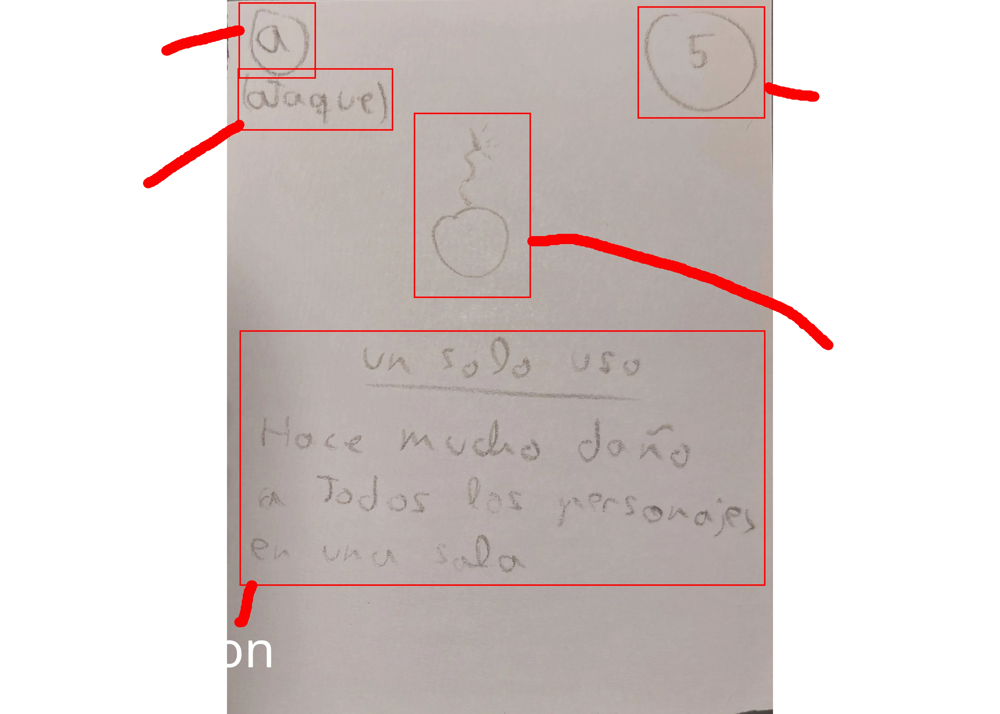

Where
- The top left icon indicates if the object is active (you need to use an action to activate it) or passive (the object is always active and doesn't require an action).
- The top right icon indicates the type of action using the object counts as, most of the time is blank. The types, when they are not blank, can be "Attack", "Movement" or "Instant". 
  - "Attack" and "Movement" mean that when you use the object, the action you are using counts as that type of action, this is relevant because if an object makes all attack actions have more range then this objects also get more range. 
  - "Instant" means that the pocket containing the object can be used at any time, including in other player's turns.
- The cost is the amount of coins you need to pay to buy the object in the shop.

### Obtaining objects

Objects can be obtained in three ways:
- Buying them in the shop by paying their cost in coins.
- Finding them by searching in armory tiles.
- Finding them by searching in rooms where a random item has spawned.
- When an object has "single use" in its description, it can only be used once, after using it, the object is discarded and the pocket that contained it is free again.

When obtaining an object the player does not need to reveal it until they decide to use it, but they need to put it in a pocket if they already have 2 objects without assigned pockets. If not they can decide if they want to put them into a pocket or not, until an object is revealed it can be moved between pockets and free spaces freely.

### Using objects

When a player wants to use the effect of an object they need to have it revealed, they can reveal an object at any time freely. If the object is active, for the player to use it they need to have it in a pocket which they will use to activate the object, if the object is passive, the player can use its effect without needing to use an action, but they need to have it revealed.

### List

This are the objects used in the first prototype:

| Name | A/P | Type | Cost | Description |
| :---: | :---: | :---: | :---: | :--- |
| Bomb | Active | Attack | 5 coins | {Single use} Deal 5 damage to all characters in range 0 (This tile) |
| Kunai | Passive | - | 6 coins | Your attack range is increased by 1 |
| Mace | Passive | - | 6 coins | Your attacks deal 5 damage |
| Lucky Coin | Passive | - | 7 coins | When you search in a treasure tile you double the number of coins you find |
| Excavator | Active | - | 5 coins | {Single use} Create a normal room adjacent to the tile you are in |
| Portal | Passive | - | 5 coins | When you perform an attack action you don't receive damage from enemies or traps in that tile, instead you appear in a random tile |
| Parasite | Passive | - | 0 coins | Does nothing |
| Gelatinous shield | Active | Instant | 5 coins | {Single use} Avoid all damage until your next turn |
| Stew | Active | - | 5 coins | {Single use} Recover two pockets |
| Health potion | Active | - | 5 coins | {Single use} Recover 5 health points |
| Emergency Time Jump | Active | Movement | 5 coins | {Single use} Move to any tile in the board, if there are enemies or traps in that tile you can ignore the damage |
| Respiration Technique | Passive | - | 6 coins | When you recover health, recover double the amount |
| Drone | A/P | - | 5 coins | If there is not a drone in place create one with 1 life as an active action. You can use your actions from the position of your drone |
| Elastic Knife | Active | Attack | 7 coins | Do 2 damage for every attack you have done this turn |
| Winged Boots | Passive | - | 6 coins | You can move two extra tiles when you move |
| Extra Pocket | Passive | - | 7 coins | You have an extra pocket, but it can only be used to carry and use objects | 
| Magnifying Glass | Passive | - | 6 coins | When you search an armory look at the object in the armory and the first object in the objects deck, take one and discard the other |
| Doctors Bag | Passive | - | 7 coins | When you kill an enemy recover 1 health point |
| Swiss Knife | Passive | - | 6 coins | This object counts as any object to avoid a trap |
| Cement | Active | - | 5 coins | {Single use} Destroy a trap in your tile and put a plain tile there |
| Spiky Jacket | Passive | - | 6 coins | When an enemy attacks you, deal 2 damage to that enemy |
| Sai | Active | Attack | 6 coins | Deal 2 damage twice |
| Mirror Image | Passive | - | 5 coins | Whenever you are about to take damage, throw a d6, if you roll a 6, avoid the damage |
| Construction Material | Active | - | 5 coins | {Single use} Create a trap in your tile, no object can avoid this trap |
| Short Swords | Passive | - | 7 coins | Whenever you take the attack action, you can instead deal 2 damage twice |
| Scythe | Passive | - | 7 coins | Whenever you deal damage recover 1 health point |
| Lance | Passive | - | 6 coins | When you pass through a tile, you can deal 2 damage to an enemy in that tile |
| Extended Arm | Passive | - | 5 coins | You can search one tile further |
| Stealing Sword | Passive | - | 5 coins | When you attack another player, you can steal one of their objects instead of dealing damage |
| Wind Movement | Passive | - | 6 coins | Whenever you attack, you can move immediately after |
| Trappers Toolkit | Active | Attack | 6 coins | Create a trap in your tile which cannot be avoided by any object, doesn't affect you and is destroyed after it is triggered |

## Traps and Monsters

Trap tiles and tiles with monsters are tiles where the player receive damage when they use a pocket in that tile.

When a player is in a tile with monsters  or a trap, and they use a pocket, they receive damage before the action resolves, but if they were to die they would die after they had finished their action. In Summary

- 1. Player uses a pocket in a tile with monsters or a trap.
- 2. Player receives damage from the monsters or the trap in that tile.
- 3. Player performs the action they wanted to perform with the pocket.
- 4. The player checks if they are dead and they act accordingly.

### Monsters

A monster card looks as follows:

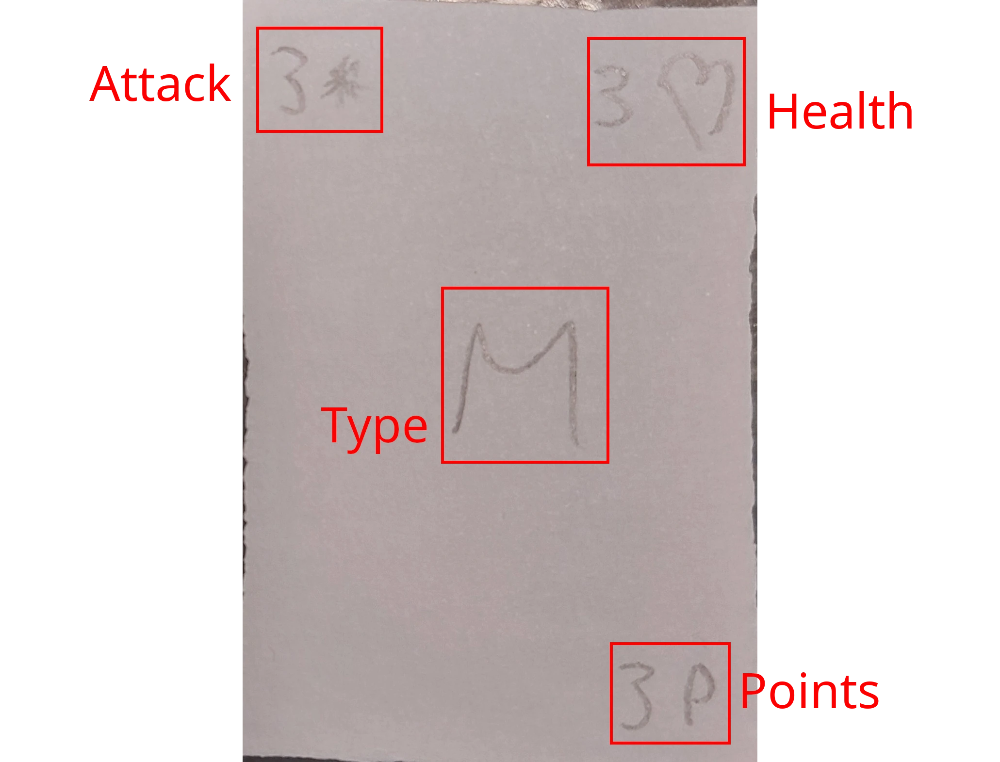

Where:
- The top left icon indicates the amount of damage the monster does.
- The top right icon indicates the health points of the monster.
- The bottom right icon indicates the amount of points the player gets for killing the monster.
- The type in the center identifies the type of monster.

Additionally, players gain gold when defeating monsters:
- Small monsters (S) give 0 coins.
- Medium monsters (M) give 1 coin.
- Large monsters (G) give 2 coins.

Monsters completely heal themselves at the end of the round.

When using a pocket in a tile with monsters, each monster deals its damage to the player, but the player can choose the order in which they receive the damage.

### Traps

Traps are tiles that, if the player doesn't have the required object to avoid that trap, deal damage when the player uses a pocket inside them or when they move through them. Each trap has a specific object that, if a player has it, they can move through and act in the trap without taking damage.

A trap tile looks as follows:

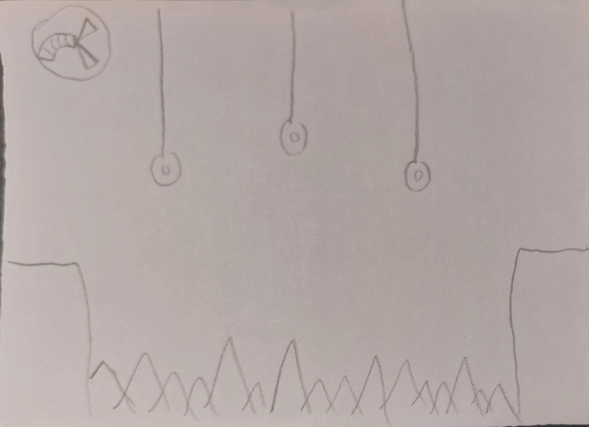

Where the icon in the top left indicates the object that can be used to avoid the trap.

## Death and stealing points

When a player's life points reach 0, they die. That is, the player returns to their starting tile and they leave in the tile where they died 5 points. If a player does not have 5 points, they will leave all their points in the tile. Other players can then pick those points up by performing a search action in that tile.

## Other tiles

### Enumerated board tiles

An enumerated board tile looks as follows:

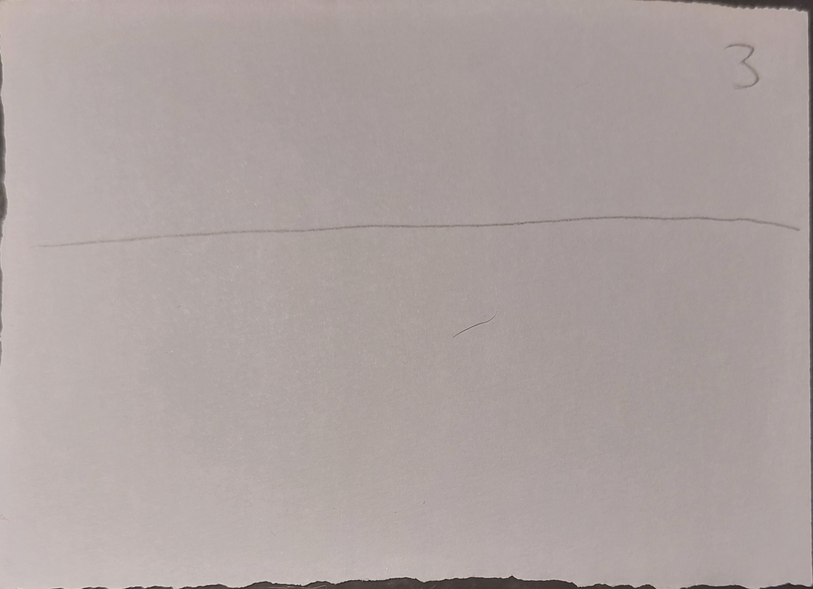

Where the number in the top right is its enumeration.

When a tile at random needs to be chosen, the players must throw 2 d6's and the enumerated tile corresponding to that number will be the one chosen.

### Intersections and corners

An intersection tile looks as follows:

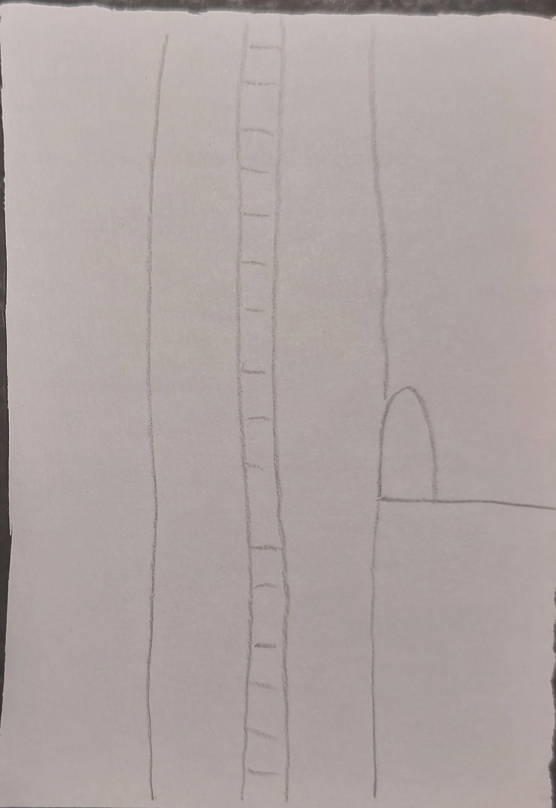

### Starting tiles

Starting tiles are the tiles where players begin the game and where they return after dying. Each player has a specific starting tile.

A starting tile looks as follows:

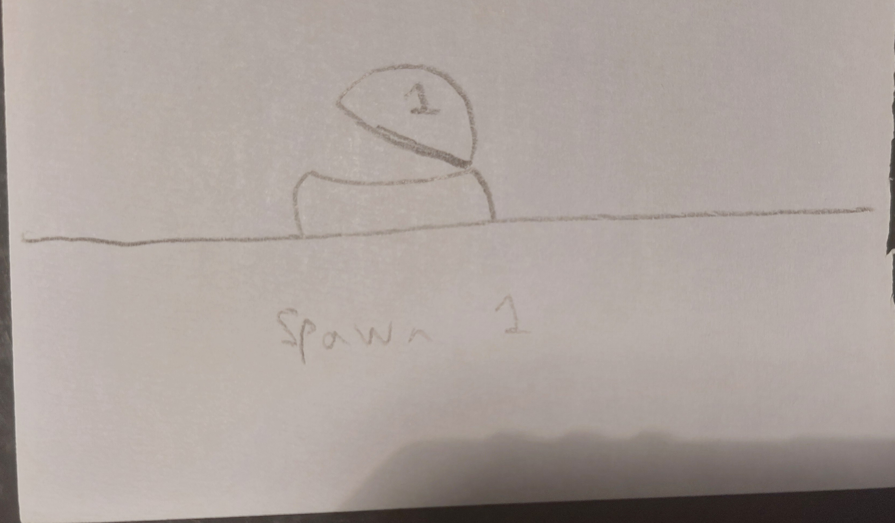

### Fountains

When searching in a fountain, if it still has 5 points in it a player may pay 1 coin to obtain those points.

A fountain tile looks as follows:

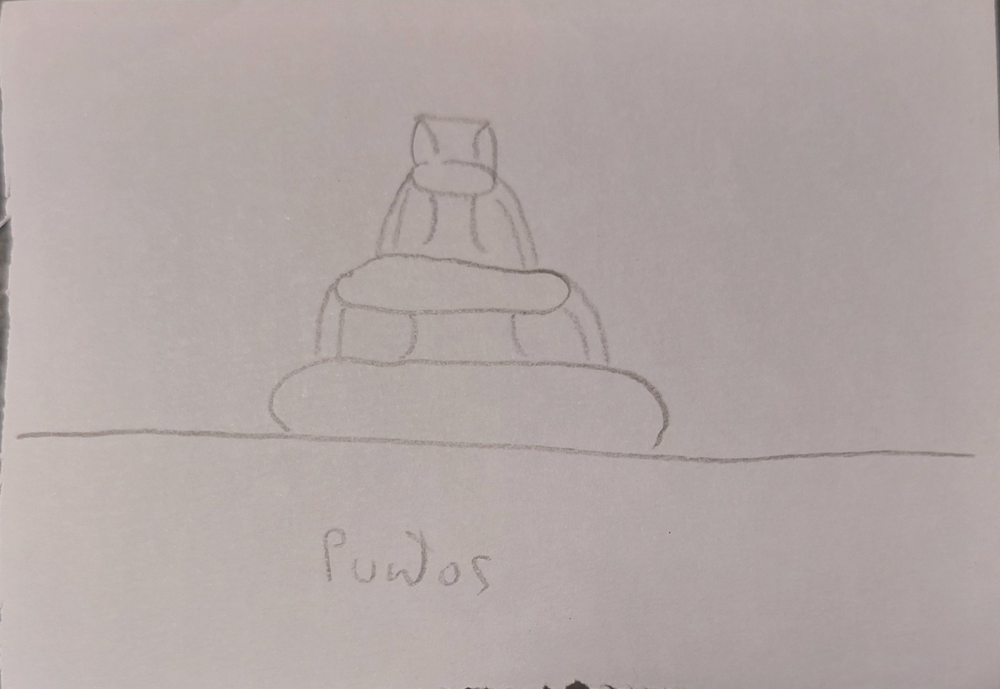

### Armories

Armouries are tiles that can contain an object, when a player searches in a non-empty armory they can obtain the object in that armory.

An armory tile looks as follows:

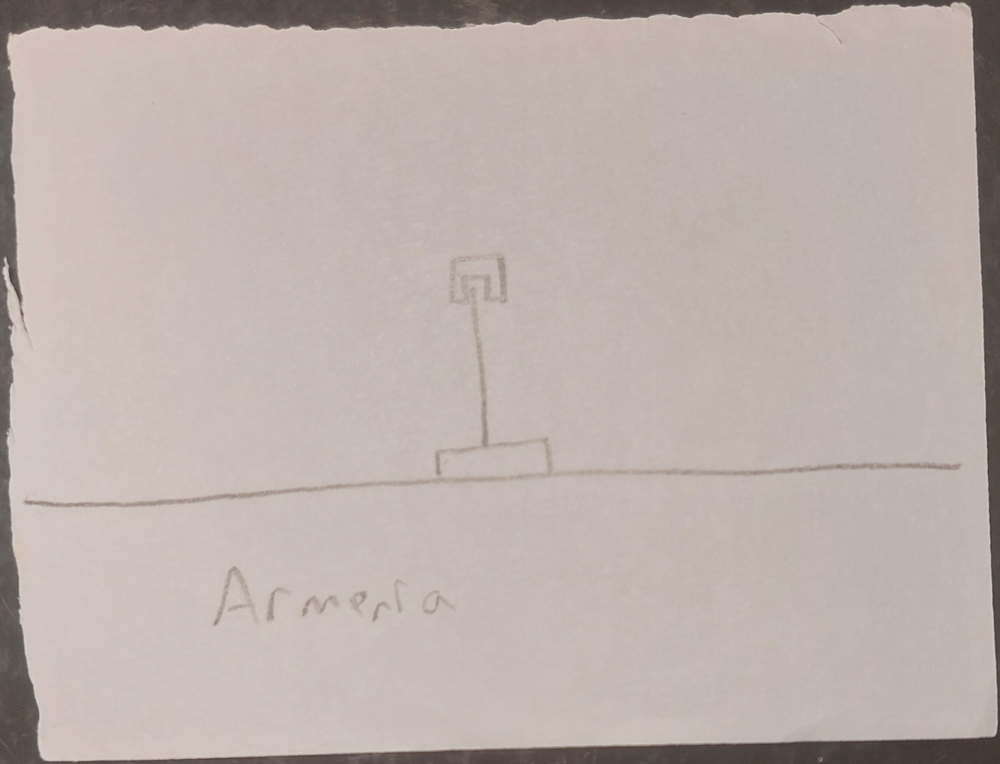

### Treasure tiles

Treasure tiles are tiles that can contain coins, when a player searches in a non-empty treasure tile they can obtain the coins in that tile.

A treasure tile looks as follows:

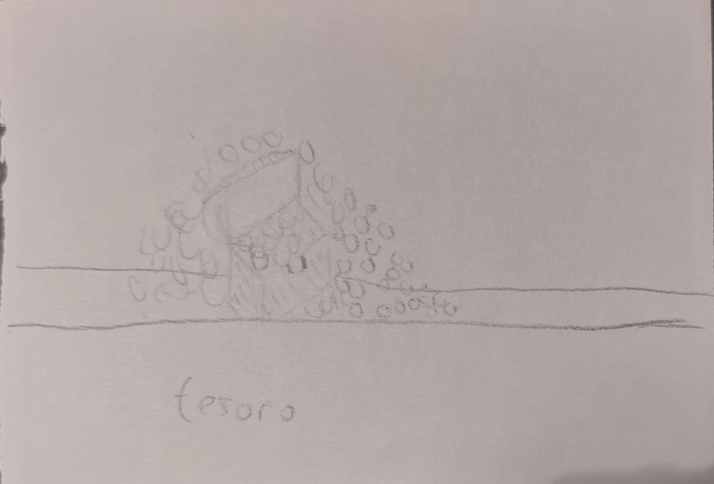

### Spawning tiles

Spawning tiles are tiles where enemies appear at the end of each round.

A spawning tile looks as follows:

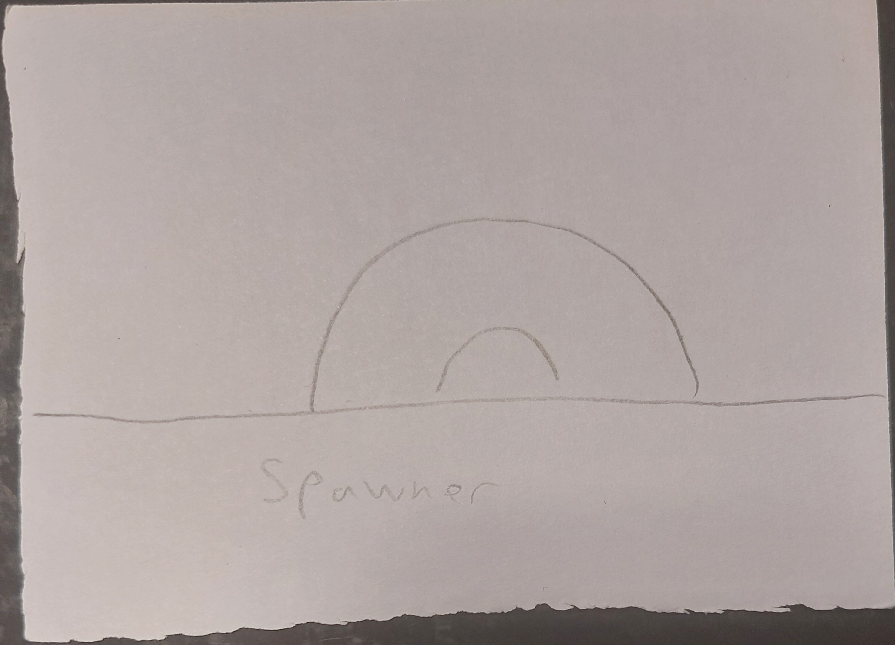

### Trash

Trash tiles are tiles where players can discard objects, when a player searches in a trash tile they can pay 1 coin to discard an object they own.

A trash tile looks as follows:

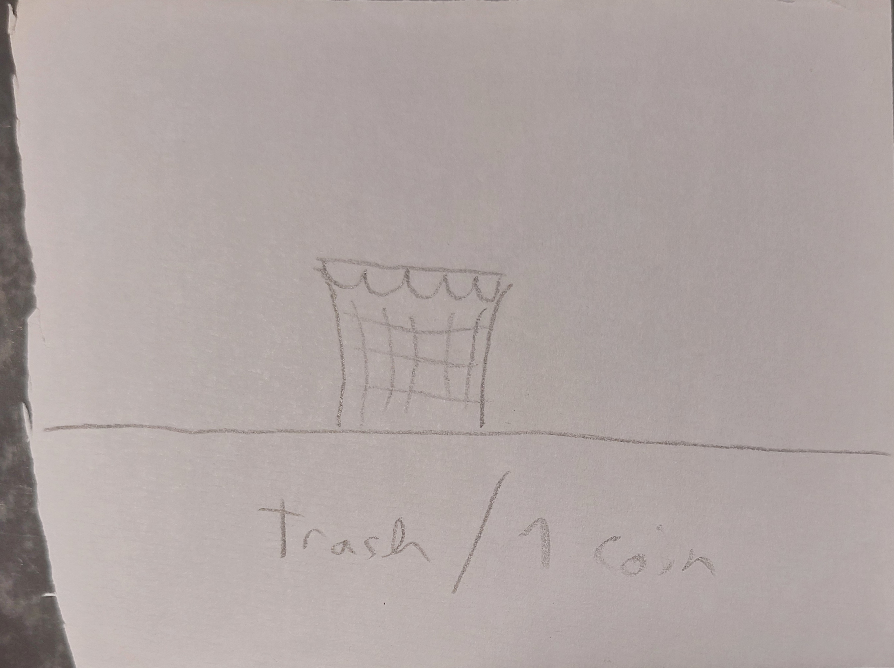

## Ending the game

The game ends the round after all enemies have entered the game, that is, when the enemy deck is emptied the last round starts.

