# Introduction

There have been many attempts at finding a topological invariant for automata. In this post we will apply a particularly simple and naive invariant to formulas in Monadic Second-order Logic of One Successor (S1S) using the Büchi automaton associated with them. The invariant presented here is not particularly powerful, but it is a good example of what a topological invariant can look like in a logical theory.

# Non-rigorous descriptions of the logical components

I will be giving a very informal definition of Monadic second order logic and Büchi automaton in order to reduce the amount of technical details and focus on the homotopy group calculation.

## Monadic Second-order Logic of One Successor (S1S)

Monadic second order logic is an extension of first-order logic where we can quantify over unary relations, i.e. subsets of the domain. 

For example the formula $\exists X \forall x (X(x) \leftrightarrow P(x))$ states that there exists a subset $X$ of the domain such that for every element $x$ of the domain, $x$ is in $X$ if and only if $P(x)$ holds.

We then define S1S as the $(0,\subseteq,\text{Succ})$-theory of the structure with universe $\mathbb{N}$, standard interpretations for $\subseteq$ and $\text{Succ}(X)=\\{ x+1 | x \in X \\}$.

For example the formula $\exists X \forall x (X(x) \leftrightarrow \text{Succ}(X)(x))$ states that there exists a subset $X$ of $\mathbb{N}$ such that for every element $x$ of $\mathbb{N}$, $x$ is in $X$ if and only if $x+1$ is in $X$.

## Büchi Automaton

An automaton is a mathematical structure which measures the concept of computability of a language. More formally,


  A \textbf{(deterministic) Büchi automaton} is a tuple $A=(Q,\Sigma,\delta,q_0,F)$ where:
  <ul>
    <li> $Q$ is a finite set of states
    <li> $\Sigma$ is a finite alphabet
    <li> $\delta \subseteq Q \times \Sigma \times Q$ is a transition relation such that for every $q \in Q$ and $a \in \Sigma$, there is exactly one $q' \in Q$ such that $(q,a,q') \in \delta$
    <li> $q_0 \in Q$ is the initial state
    <li> $F \subseteq Q$ is the set of accepting states
  </ul>

  We define a \textbf{run} of $A$ on an infinite word $w=w_0 w_1 w_2 \ldots$ over $\Sigma$ as a sequence of states $r=r_0 r_1 r_2 \ldots$ such that $r_0=q_0$ and for every $i \geq 0$, $(r_i,w_i,r_{i+1}) \in \delta$.
  
  We say that $A$ \textbf{accepts} $w$ if there exists a run $r$ of $A$ on $w$ such that the set of states that appear infinitely often in $r$ has a non-empty intersection with $F$. The language recognized by $A$, denoted by $L(A)$, is the set of infinite words over $\Sigma$ that are accepted by $A$.


The tuple representation of a Büchi automaton is the formal definition, but it is much more intuitive to work with a graphical representation where:
- States are represented as nodes in a graph
- Transitions are represented as directed edges between nodes, labeled with the input symbol that triggers the transition
- The initial state is often indicated with an incoming arrow from nowhere
- Accepting states are indicated with a double circle on the node
- If there is a transition that is not explicitly represented for a state and an input symbol, it is assumed that the automaton transitions to a non-accepting sink state.
- If more than one input symbol sends one state to another, we can represent this with a single edge labeled with the set of input symbols that trigger the transition.


  Consider the Büchi automaton $A$ defined by the tuple (Q, $\Sigma$, $\delta$, $q_0$, F) where:
  <ul>
    <li> $Q=\{q_0,q_1\}$
    <li> $\Sigma=\{0,1\}$
    <li> $\delta=\{(q_0,0,q_0),(q_0,1,q_1),(q_1,0,q_1),(q_1,1,q_0)\}$
    <li> $q_0$ is the initial state
    <li> $F=\{q_1\}$ is the set of accepting states
  </ul>

  Notice this automaton describes the language of infinite words over $\{0,1\}$ that contain infinitely many $1$s or an even number of them.

  The graphical representation of this automaton is as follows:

  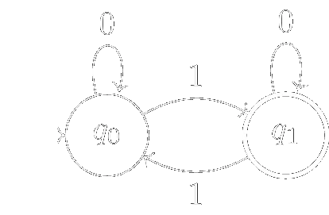

  This automaton will accept the infinite word $w=0101010000\ldots$ with run $q_0 q_0 q_1 q_1 q_0 q_0 q_1 q_1 q_1 q_1 \ldots$ because the set of states that appear infinitely often in this run is $\{q_1\}$ which has a non-empty intersection with $F$.



An automaton needs not be deterministic, but for the purposes of this post we will only be interested in deterministic Büchi automata. Nevertheless it will be important to know what a non-deterministic Büchi automaton is. and how to make it deterministic.


  A \textbf{non-deterministic Büchi automaton} is a tuple $A=(Q,\Sigma,\delta,q_0,F)$ where:
  <ul>
    <li> $Q$ is a finite set of states
    <li> $\Sigma$ is a finite alphabet
    <li> $\delta \subseteq Q \times \Sigma \times Q$ is a transition relation such that for every $q \in Q$ and $a \in \Sigma$, there is at least one $q' \in Q$ such that $(q,a,q') \in \delta$
    <li> $q_0 \in Q$ is the initial state
    <li> $F \subseteq Q$ is the set of accepting states
  </ul>

  The main difference from a deterministic Büchi automaton is that we allow for multiple transitions from a state on the same input symbol. We define a run as a (possibly infinite) number of runs of a deterministic Büchi automaton, one for every possible choice of transition at each step. We say that a non-deterministic Büchi automaton accepts an infinite word if there exists at least one run that accepts it.


### Operations on Büchi Automata

We will see now some operations over Büchi automata that will be useful for the construction of a Büchi automaton from a formula in S1S. These operations are not particularly difficult to understand, but they are a bit technical to write down formally and I do not intend for this post to be an exhaustive study of automata, so I will give an informal algorithm for each one.

We can reduce a non-deterministic Büchi automaton to a deterministic one using the following algorithm:



<ol>
  <li> We start with a non-deterministic Büchi automaton $A=(Q,\Sigma,\delta,q_0,F)$.
  <li> We construct a new set of states $Q'=\mathcal{P}(Q)$, the power set of $Q$.
  <li> We define the initial state of the new automaton as $q_0'=\{q_0\}$.
  <li> We define the transition relation $\delta'$ for the new automaton as follows: for every $S \subseteq Q$ and $a \in \Sigma$, we define $\delta'(S,a)=\bigcup_{q \in S} \{ q' | (q,a,q') \in \delta \}$.
  <li> We define the set of accepting states for the new automaton as $F'=\{ S \subseteq Q | S \cap F \neq \emptyset \}$.
  <li> The resulting deterministic Büchi automaton is then given by the tuple $(Q',\Sigma,\delta',q_0',F')$.
  </ol>


We can, doing something similar, define the "product" of two Büchi automata $A_1$ and $A_2$ as the Büchi automaton that recognizes the language of infinite words that are accepted by both $A_1$ and $A_2$. This is done by applying the following algorithm:


<ol>
  <li> We start with two Büchi automata $A_1=(Q_1,\Sigma,\delta_1,q_{0,1},F_1)$ and $A_2=(Q_2,\Sigma,\delta_2,q_{0,2},F_2)$.
  <li> We construct a new set of states $Q=Q_1 \times Q_2$.
  <li> We define the initial state of the new automaton as $q_0=(q_{0,1},q_{0,2})$.
  <li> We define the transition relation $\delta$ for the new automaton as follows: for every $(q_1,q_2) \in Q$ and $a \in \Sigma$, we define $\delta((q_1,q_2),a)=\{ (q_1',q_2') | (q_1,a,q_1') \in \delta_1 \text{ and } (q_2,a,q_2') \in \delta_2 \}$.
  <li> We define the set of accepting states for the new automaton as $F=\{ (q_1,q_2) | q_1 \in F_1 \text{ and } q_2 \in F_2 \}$.
  <li> The resulting Büchi automaton is then given by the tuple $(Q,\Sigma,\delta,q_0,F)$.
  </ol>


One last useful operation we will need is the simplification of a Büchi automaton. Given an automaton $A$, we can construct a unique minimum-sized (in number of steps) automaton $A'$ that recognizes the same language as $A$ by applying the following algorithm:


<ol>
  <li> We start with a Büchi automaton $A=(Q,\Sigma,\delta,q_0,F)$.
  <li> We construct a new set of states $Q'=\{ q \in Q | \text{ there exists an infinite word } w \text{ such that } A \text{ accepts } w \text{ and the run of } A \text{ on } w \text{ visits } q \}$.
  <li> We define the initial state of the new automaton as $q_0$ if $q_0 \in Q'$ and as a new non-accepting sink state otherwise.
  <li> We define the transition relation $\delta'$ for the new automaton as follows: for every $q,q' \in Q'$ and $a \in \Sigma$, we define $\delta'(q,a)=\{ q' | (q,a,q') \in \delta \}$ if $q' \in Q'$ and $\delta'(q,a)=\emptyset$ otherwise.
  <li> We define the set of accepting states for the new automaton as $F'=\{ q \in Q' | q \in F \}$.
  <li> The resulting Büchi automaton is then given by the tuple $(Q',\Sigma,\delta',q_0',F')$.
  </ol>


This last operation is particularly useful because the minimum automaton of a language is unique, so it gives us a canonical representative for the language recognized by a Büchi automaton.

# Relationship between S1S and Büchi Automaton

The way we will calculate the homotopy group of a formula in S1S is by studying the Büchi automaton associated with it. To do this we need to establish a relationship between formulas in S1S and Büchi automata.

## Simplification of S1S formulas

First we need to codify the variables of a formula in S1S as something an automata can understand.

One can rewrite a formula in S1S interpreted in a model of S1S as a first order $(0\in,\subseteq,\text{Succ},\text{Sing})$-formula interpreted over a structure with universe $\mathcal{P}(\mathbb{N})$ and standard interpretations for $0\in$ and $\subseteq$, $\text{Succ}(X)=\\{ x+1 | x \in X \\}$, and $\text{Sing}(X)$ holds if and only if $X$ is a singleton. Indeed, it is enough to rewrite the second order quantifiers as first order quantifiers over subsets of $\mathbb{N}$ and the first order quantifiers as subsets of $\mathcal{P}(\mathbb{N})$ satisfying Sing.

Using this interpretation we can consider subsets of $\mathbb{N}$ as the domain of our formulas and write our formulas using only $0\in,\subseteq,\text{Succ},\text{Sing}, \exists, \land$ and $\lnot$ (everything else can be defined using first order logic).


  Consider the formula $\exists X \forall x, X(x) \rightarrow \text{Succ}(X)(x)$:
  $$\begin{align*}
    &\exists X \forall x, X(x) \rightarrow \text{Succ}(X)(x)\\
    &\equiv \  \exists X \forall Y, \text{Sing}(Y) \rightarrow (Y \subseteq X \rightarrow Y \subseteq \text{Succ}(X)))\\
    &\equiv \  \exists X \lnot \exists Y \lnot(\text{Sing}(Y) \rightarrow (Y \subseteq X \rightarrow Y \subseteq \text{Succ}(X)))\\
    &\equiv \  \exists X \lnot \exists Y, \text{Sing}(Y) \land \lnot (Y \subseteq X \rightarrow Y \subseteq \text{Succ}(X))\\
    &\equiv \ \exists X \lnot \exists Y, \text{Sing}(Y) \land Y \subseteq X \land \lnot Y \subseteq \text{Succ}(X)
  \end{align*}$$


Because $\mathbb{N}$ is countable, we can encode subsets of $\mathbb{N}$ as infinite sequences of bits, where the $n$-th bit is $1$ if $n$ is in the subset and $0$ otherwise. This way we can interpret formulas in S1S as languages of infinite words over the alphabet $\{0,1\}$.

> [!WARNING]
> There is a detail in this reasoning I have't explained. S1S is a second order theory which models subsets of $\mathbb{N}$. It is not obvious (even if it is true) that there isn't an uncountable model in this theory.

## From S1S formulas to Büchi automata

We can now define an equivalence between formulas in S1S and Büchi automata. 


  We say that a formula $\phi(x)$ in S1S is equivalent to a Büchi automaton $A$ if the language of infinite words recognized by $A$ is exactly the set of infinite words that encode subsets of $\mathbb{N}$ that satisfy $\phi$.


There is a well-known result that states that for every formula $\phi$ in S1S, there exists a Büchi automaton $A$ such that $\phi$ is equivalent to $A$. Conversely, for every Büchi automaton $A$, there exists a formula $\phi$ in S1S such that $\phi$ is equivalent to $A$. For the purposes of this post we will only be interested in the first direction of this result as it gives a construction of a Büchi automaton from a formula in S1S.


  For every formula $\phi$ in S1S, there exists a Büchi automaton $A$ such that $\phi$ is equivalent to $A$.


To prove this result it is enough to show how to construct a Büchi automaton from $0\in,\subseteq,\text{Succ},\text{Sing}, \exists, \land$ and $\lnot$, the result then follows by induction. The construction is as follows:
 -  $0\in X$: 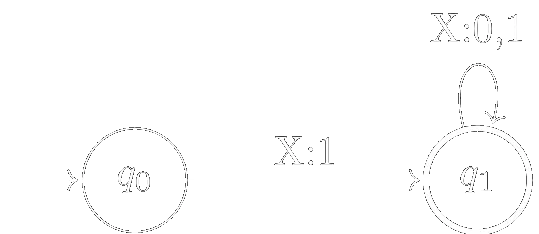
 - $X\subseteq Y$: 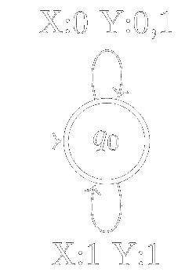
 -  $Y=\text{Succ}(X)$: 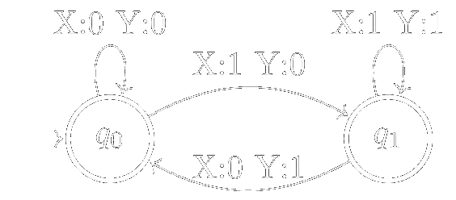
 - $\text{Sing}(X)$: 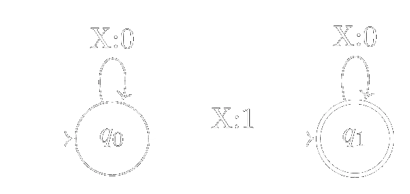
 - $\phi_1 \land \phi_2$: Let $A_1$ and $A_2$ be the Büchi automata that recognize the languages of infinite words that satisfy $\phi_1$ and $\phi_2$ respectively. We construct the Büchi automaton of $\phi_1 \land \phi_2$ by taking the product of $A_1$ and $A_2$ using the product construction for Büchi automata.
 - $\exists$: For the existential quantifier we can use the following construction: given a Büchi automaton $A$ that recognizes the language of infinite words that satisfy $\phi$, we can construct a new Büchi automaton $A'$ that recognizes the language of infinite words that satisfy $\exists X \phi$ by removing the values of $X$ from the transitions of $A$. This leaves us with a non-deterministic Büchi automaton, but we can use the standard subset construction to determinize it.
 - $\lnot \phi$: Let $A$ be the Büchi automaton that recognizes the language of infinite words that satisfy $\phi$. We can construct a new Büchi automaton $A'$ that recognizes the language of infinite words that satisfy $\lnot \phi$ by swapping the accepting and non-accepting states of $A$.


  Consider the formula $\phi(Y):= \forall x, Y(x) \rightarrow \text{Succ}(Y)(x)$. We have seen in a previous example that we can rewrite this formula in first order as $\phi(Y):= \lnot \exists X, \text{Sing}(X) \land X \subseteq Y \land \lnot X \subseteq \text{Succ}(Y)$. Lets construct the Büchi automaton associated with this formula starting with the components separated by the $\land$:
  <ul> 
  <li> Sing$(X)$: 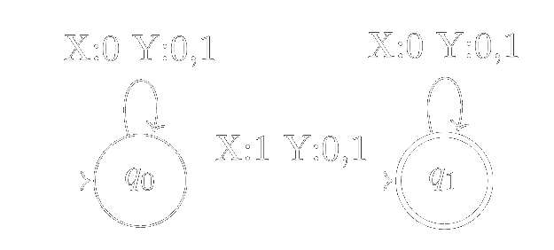
  <li> $X \subseteq Y$: 
  <li> $\lnot X \subseteq \text{Succ}(Y)$: We first construct the Büchi automaton for $X \subseteq \text{Succ}(Y)$. The most standard way of building it would be dividing this formula by $\forall Z(X \subseteq Z \land Z = \text{Succ}(Y))$ but for the sake of convenience I will add a direct representation: 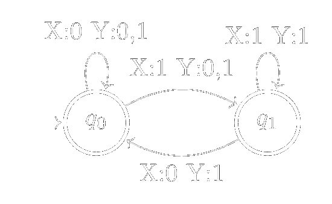 We then swap the accepting and non-accepting states to get the Büchi automaton for $\lnot X \subseteq \text{Succ}(Y)$: 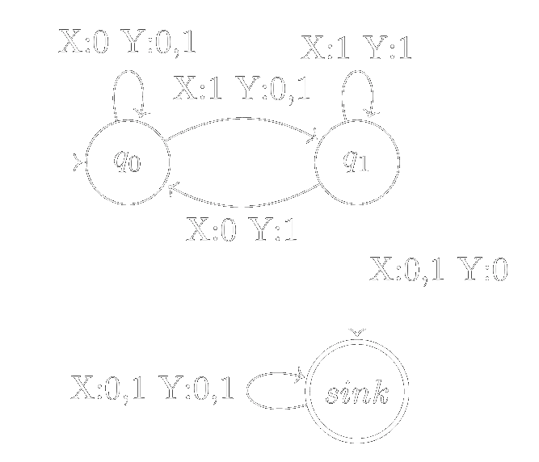
  Notice in this last one we have represented the sink state we usually omit because when negating the automaton it becomes an accepted state and as such can not be omitted.
  </ul>
  We now take the product of this 3 automata:
  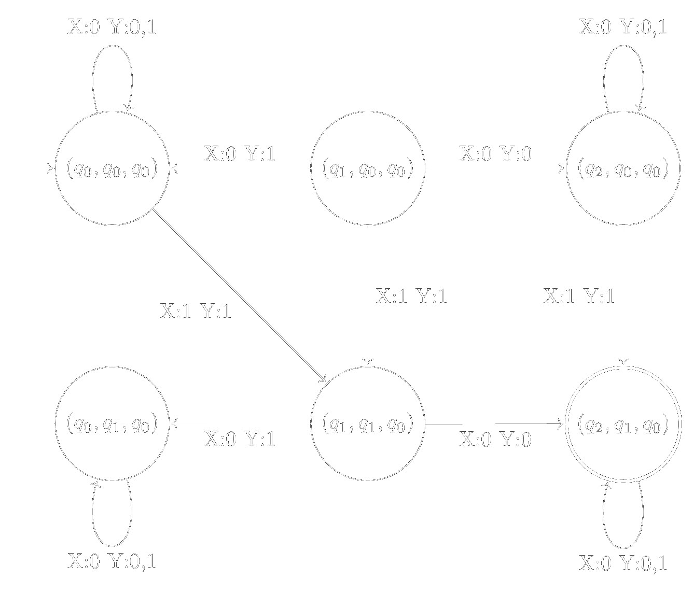
  Where each state is represented as a triple of states, the first component is the automaton for $\lnot X \subseteq \text{Succ}(Y)$ (I have substituted sink by $q_2$ for readability), the second component is the automaton for $\text{Sing}(X)$ and the third component is the automaton for $X\subseteq Y$. We can clean the automaton by simplifying the notation, removing the states that are inaccessible from the initial state and adding the sink state (where all the transitions that are not explicitly represented go, it will be important to represent it for the next steps):
  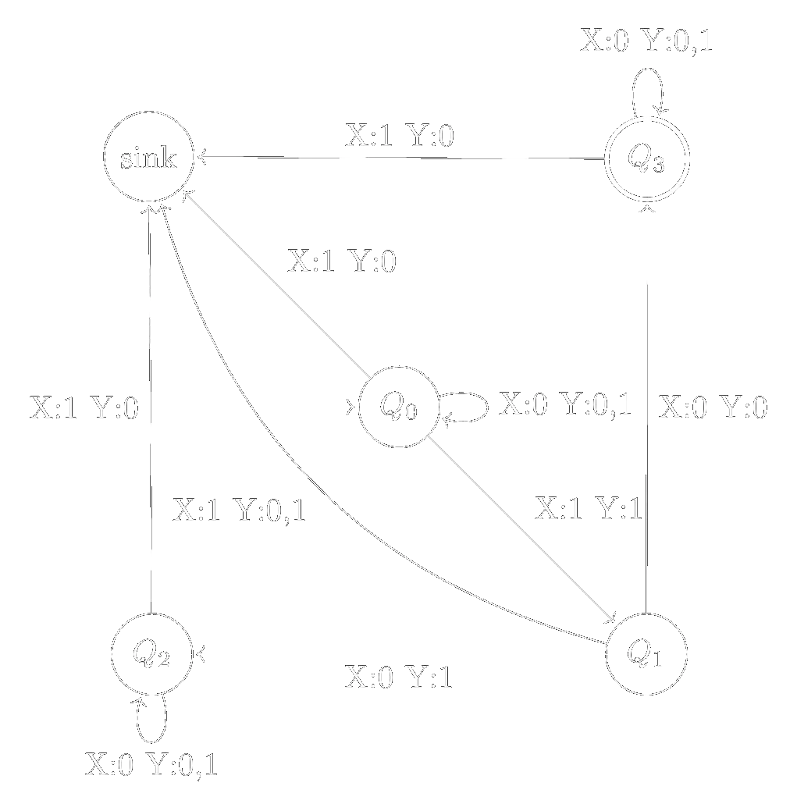

  We then apply the construction for the existential quantifier to get the Büchi automaton for $\exists X, \text{Sing}(X) \land X \subseteq Y \land \lnot X \subseteq \text{Succ}(Y)$:
  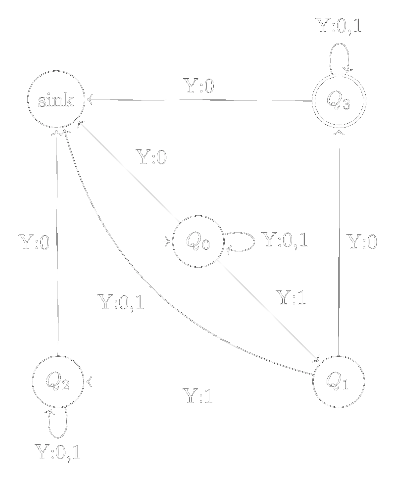
  Notice this automaton is non-deterministic,in order to continue we need to apply the subset construction to get a deterministic Büchi automaton (Substituting sink by $Q_4$ for readability):
  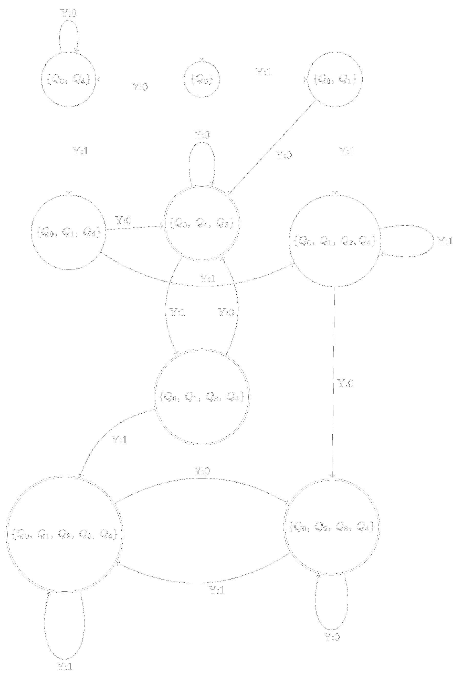
  We can use the reduction algorithm and a renaming of the states to get a more readable automaton:
  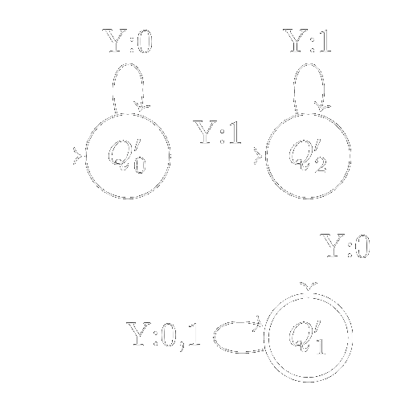
  Finally we swap the accepting and non-accepting states to get the Büchi automaton for $\phi(Y)$:
  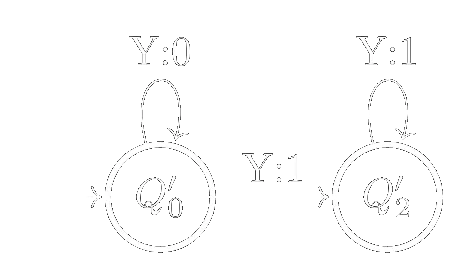


# Calculating the homotopy group of a formula in S1S

Now that we have established a relationship between formulas in S1S and Büchi automata, we can calculate the homotopy group of a formula in S1S by studying the homotopy group of its associated Büchi automaton.

I have found multiple approaches to define the homotopy group of a Finite State Automaton which has the same structure as a Büchi automaton and as such can be extrapolated to it. From this I have selected one not only because it is the simplest one, but also because it is the one retaining the most information.


  Let $A=(Q,\Sigma,\delta,q_0,F)$ be a (minimal) deterministic Büchi automaton. We can define the homotopy group of $A$ as the free group generated by the loops in the graph of $A$ based at the initial state $q_0$, where a loop is a path that starts and ends at $q_0$. The group operation is given by concatenation of loops and the inverse of a loop is given by traversing the loop in the opposite direction.


The condition of being a minimal automaton is important because otherwise we could have multiple automata that are equivalent to each other (in the sense that they accept the same language) with different homotopy groups. This would stop this definition of homotopy group from being an invariant in Büchi automata, much less in S1S formulas.

The definition given above basically asks to consider the graphic representation of an automata as the graph of a space and calculate the homotopy group of such a space. In this particular case a n input could be understood as a path in the space, so we are basically calculating the homotopy group of the space of paths in the automaton.


  Consider the formula $\phi(Y):= \forall x, Y(x) \rightarrow \text{Succ}(Y)(x)$ and its associated Büchi automaton:
  
  We can see that there are two loops, one based at the initial state $Q'_0$, and one based at $Q'_2$ and one that goes through $Q'_1$. We will call these loops $a$ and $b$ respectively. There are no other loops based at $Q'_0$, so the homotopy group of this automaton is the free group generated by $a$ and $b$, which is isomorphic to the free group on two generators, denoted by $\mathbb{F}_2$.


## Future work

I have seen multiple different definitions of the homotopy group of a Büchi automaton. One particularly interesting consisted in treating an automata as a simple category where the objects are the states and the morphisms are the paths between states. The homotopy group of the automaton is then defined using the nerve of this category. This definition is more interesting than the one given above, but it is also more difficult to calculate and it loses a considerable amount of information which makes me doubt it's usefulness. 

 Nevertheless, categories can be understood (in quite a heretical way) as graphs with extra structure. So it may be possible to encode an important part of the information of an automaton in the category structure and then use the nerve to calculate a more interesting homotopy group. That being said this is not my area of expertise and I do not know if I will have time to pursue this line of research in the near future. That being said, if the reader is interested in this topic they are encouraged to explore it further.