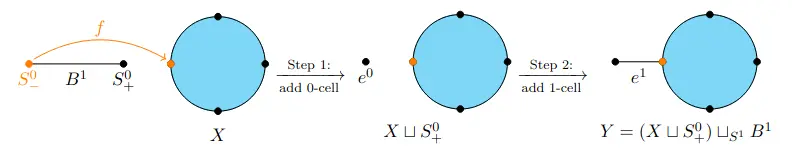
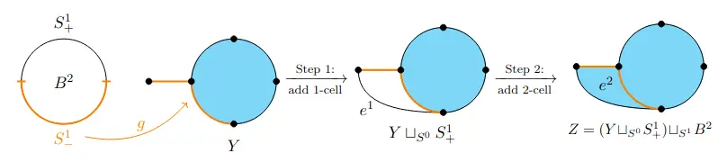

# Introduction

Homotopy equivalences describes a very strong similarity between two topological spaces, nevertheless that function can be very hard to describe. Our objective will be to check a stronger condition of equivalence between spaces: simple homotopy equivalence, which implies the transformation between the spaces is simple.

# Simple Homotopy Equivalence

We start by defining what a simple Homotopy Equivalence is, for that we first need to understand the concept of elementary expansion and elementary retraction.


Let $K$ be a simplicial complex and let $\sigma$ be a simplex of $K$. 
A face $\tau < \sigma$ is called a \emph{free face} of $\sigma$ if 
$\tau$ is contained in $\sigma$ and in no other simplex of $K$ of 
higher dimension.


Essentially, a free face of a simplex $\sigma$ is a face whose only connection to the complex is by $\sigma$. With this we can define an elementary expansion.


Let $X$ be a CW complex. An <strong>elementary expansion</strong> of $X$ is the map describing the process of forming a new CW complex $Y$ by adjoining a pair of cells $(e^{n},e^{n+1})$ to $X$ where $e^{n}$ is a free face of $e^{n+1}$.


An elementary expansion is, intuitively, to add a simplex and an exterior face to our space. 

The following pictures from <a href="https://www.math.toronto.edu/qiu/writings/SimpleHomotopy.pdf"> Arthur Lei Qiu's notes on "SIMPLE HOMOTOPY EQUIVALENCE AND WHITEHEAD GROUPS"</a> describe an elementary expansion on $X$ by a 1-cell:

> [!NOTE] We then define an elementary collapse as the opposite operation, to remove a simplex with a face "in the boundary".


Let $K$ be a simplicial complex. Suppose $\sigma$ is a simplex of $K$ and 
$\tau < \sigma$ is a face of $\sigma$ that is a free face; that is, $\tau$ is 
contained in $\sigma$ and in no other simplex of $K$. We define an <strong>elementary collapse</strong> as the natural map from $K$ to $K\setminus \{\sigma, \tau\}$.


We now have the language to define a simple homotopy equivalence


Let $f : X \to Y$ be a map of finite CW-complexes. We call it a <strong>simple homotopy equivalence</strong> if there is a sequence of maps

$$X = X[0] \xrightarrow{f_0} X[1] \xrightarrow{f_1} X[2] 
\xrightarrow{f_2} \cdots \xrightarrow{f_{n-1}} X[n] = Y$$
such that each $f_i$ is an elementary expansion or elementary collapse and $f$ is homotopic to the composite of the maps $f_i$.


A function is a simple homotopy equivalence if it can be described by inserting or removing finitely many simplexes. Our objective in this post is to decide if a given homotopy equivalence is simple.

# The Whitehead torsion for chain complexes

We now define the obstruction used as a sufficient and necessary condition to check a chain homotopy equivalence is "simple" in a similar way as the one described above, we will later expand this definition to topological spaces.

## Definition


Let $C_*$ be a contractible $R$-chain complex, we define a <strong>chain contraction</strong> as a collection of $R$-homomorphisms $\gamma_n:C_n\to C_{n+1}$ such that $c_{n+1}\circ \gamma_n +\gamma_{n-1}\circ c_n =id_{C_n}$ for all $n\in \mathbb{Z}$.


Having a chain contraction is equivalent to being contractible as it can be easily checked that if a chain has a chain contraction, its homology is everywhere 0.

Because we are going to be working with the whitehead group it would be useful to not allow basis changes in the modules.


A chain complex $C_*$ of $R$-modules is called <strong>>based free</strong> if for every $n$ the module $C_n$ is a finitely generated free $R$-module together with a specified basis.


We are now ready to define the torsion of a chain complex


Let $C_*$ be a based free contractible $R$-chain complex. Consider the functors $(-)_{odd}$ and $(-)_{even}$ with 
$$(C_*)_{odd}=\bigoplus_{n\in\mathbb{Z}}C_{2n+1}, \ (C_*)_{even}=\bigoplus_{n\in\mathbb{Z}}C_{2n}.$$
Let $\gamma_*$ be a chain contraction, we define the <strong>Whitehead torsion</strong> of $C_*$ as
$$\tau(C_*):=\left[(c_*+\gamma_*)_{odd}\right]\in \tilde{K}_1(R).$$


The definition does not depend on the decision of $\gamma$ but I will leave this unproven.

## Examples

> [!NOTE] I want to add examples at some point but i am slightly out of time for my exam so I will do this later.

# The Whitehead torsion for topological spaces.

We now apply the previous definition to topological spaces

## Definition

> [!NOTE] I would like to add a bit of a preamble and explanation on here, TODO


Let $f:X\to Y$ be a cellular homotopy equivalence of connected finite CW-complexes $X, Y$ with $\pi_1(X)=\pi_1(Y)=:\pi$, let $\tilde{X}$ and $\tilde{Y}$ be their respective universal coverings. consider the lift of $f$ along the covering $\tilde{f}: \tilde{X}\to \tilde{Y}$, we define the <strong>Whitehead torsion of </strong>$f$, $\tau(f)$, as the projection of 
$$\tau\left(cone\left(\tilde{f}\right)\right)\in\tilde{K}_1(\mathbb{Z}\pi)$$
into the whitehead group $Wh(\pi)$:
$$\tau(f):=\left[\tau\left(cone\left(\tilde{f}\right)\right)\right]\in Wh(\pi).$$


This is well defined because $cone(\tilde{f})$ is contractible for any $f$ homotopy equivalence and you can always take a cellular basis as the preferred base for the $R\pi$-modules.

Since $\tau(f)\in Wh(\pi)$ the choice of the cellular basis does not
matter anymore. 

## Calculation

> [!NOTE] TODO: add an explicit calculation at some point, you would need to be insane to try to do it that way but it is nevertheless a good way of memorizing the definition. I would also like to clean this next lemma and calculate something using it.


<ol>
<li>
Let $X_0, X_1, X_2, Y_0, Y_1, Y_2$ be finite CW-complexes such that there is a homotopy equivalence $f_i:X_i\to Y_i$ for $i=0,1,2$, then the function 
$$f:=f_1\bigcup_{f_0} f_2: X:=X_1\bigcup_{X_0} X_2\to Y:= Y_1\bigcup_{Y_0} Y_2$$ 

is a homotopy equivalence and we can calculate its torsion by
$$\tau(f) = (l_1)_* \tau(f_1) + (l_2)_* \tau(f_2) - (l_0)_* \tau(f_0)$$

where $l_i$ is the natural immersion from $Y_i$ to $Y$ for $i=0,1,2$.

</li>

<li>
<strong>Homotopy invariance</strong>

Let $ f \simeq g : X \to Y $ be homotopic maps of finite CW-complexes. Then the homomorphisms 
$ f_*, g_* : \mathrm{Wh}(\pi_1(X)) \to \mathrm{Wh}(\pi_1(Y))$ agree. If additionally f and g are homotopy equivalences, then we obtain
$$
\tau(g) = \tau(f);
$$
</li>

<li>
<strong>Composition formula</strong>

Let $ f : X \to Y $ and $ g : Y \to Z$ be homotopy equivalences of finite CW-complexes. Then we get
$$
\tau(g \circ f) = g_* \tau(f) + \tau(g);
$$
</li>

<li> <strong>Product formula</strong>

Let $f : X' \to X$ and $g : Y' \to Y$ be homotopy equivalences of connected finite CW-complexes. Then
$$
\tau(f \times g) = \chi(X) \cdot j_* \tau(g) + \chi(Y) \cdot i_* \tau(f)
$$
where $\chi(X), \chi(Y) \in \mathbb{Z}$ denote the Euler characteristics, $j_* : \mathrm{Wh}(\pi_1(Y)) \to \mathrm{Wh}(\pi_1(X \times Y)) $ is the homomorphism induced by 
$j : Y \to X \times Y, \quad y \mapsto (y, x_0)$
for some base point $ x_0 \in X $, and $i_*$ is defined analogously.
</li>
</ol>


Notice that by using the homotopy invariance property we can can define the torsion over non-cellular $f$ thanks to the cellular approximation theorem.

# Checking if a homotopy equivalence is simple

This last theorem give us the sufficient and necessary condition we were looking for


Let $f:X\to Y$ be a homotopy equivalence of finite CW-complexes. $f$ is a simple homotopy equivalence if and only if $\tau(f)=0$.


> [!NOTE] TODO: add an example of usage like proving that any homotopy equivalence between spaces with fundamental group $\mathbb{Z}$ is simple.